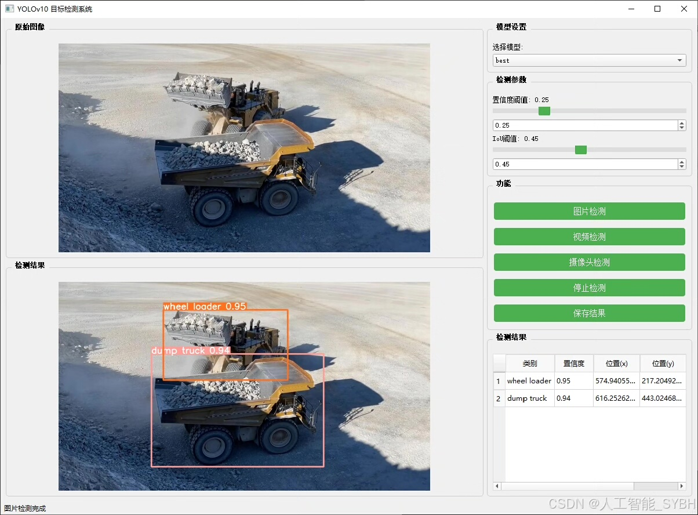
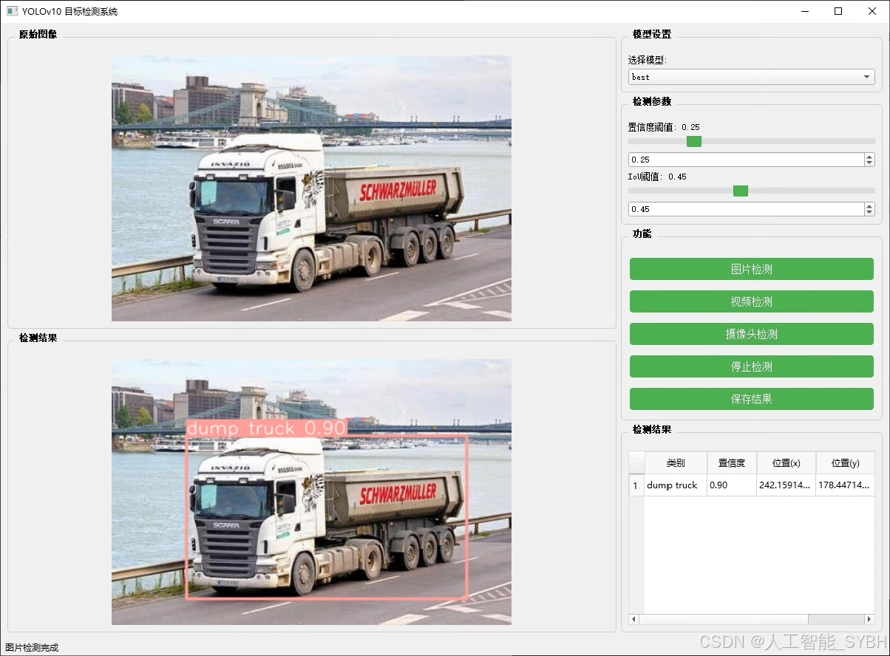
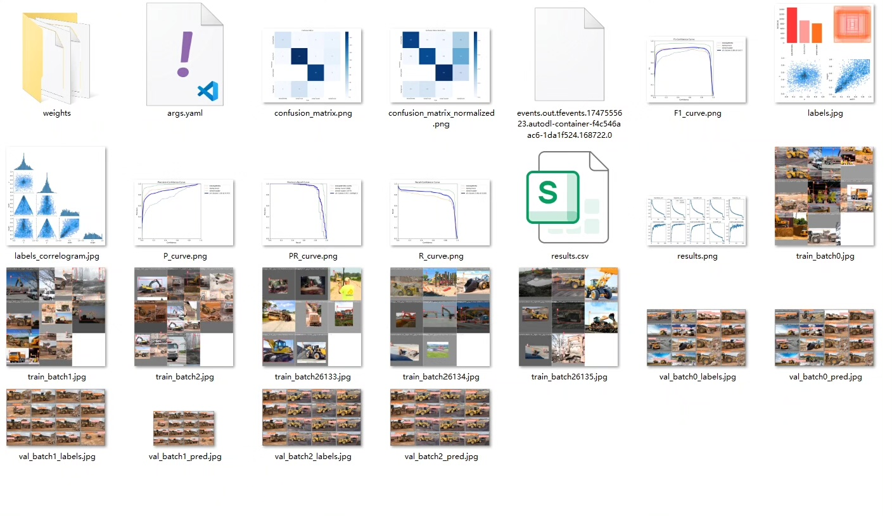
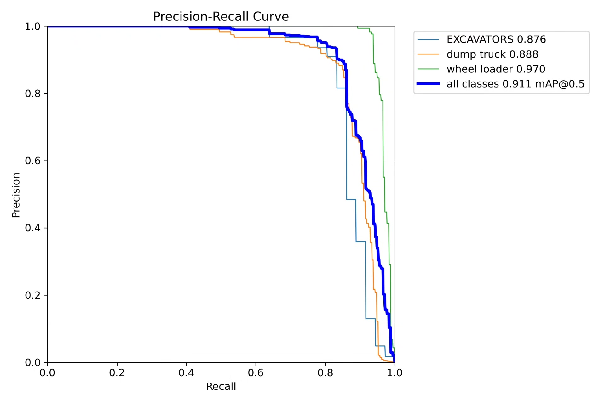
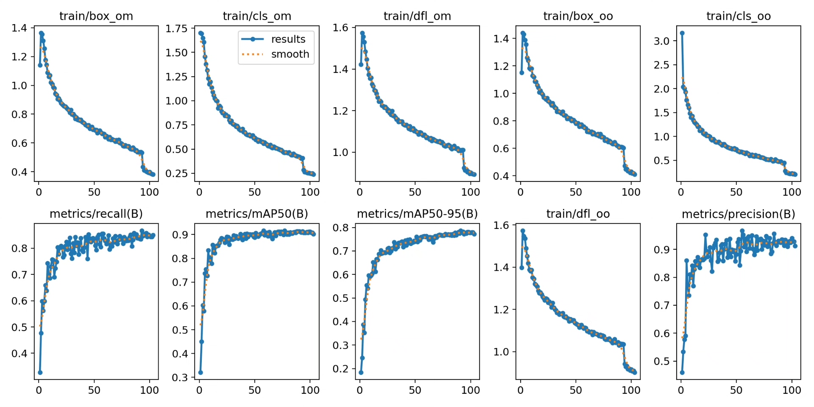
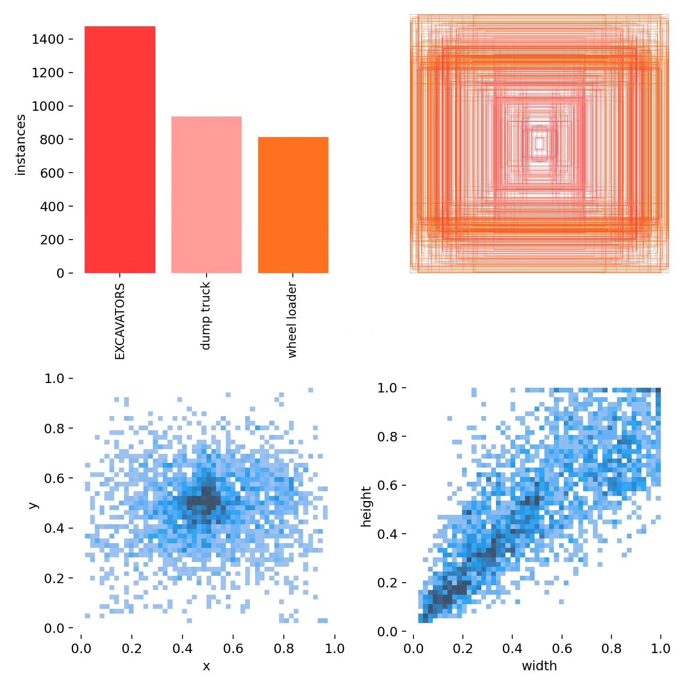
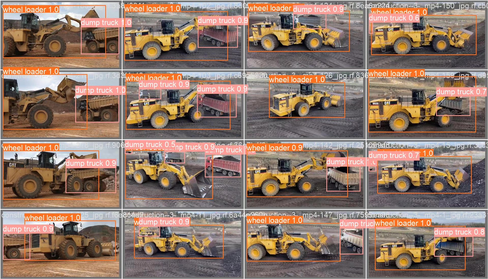

# Based on deep learning YOLOv10, the construction site transport vehicle recognition detection system (YOLO)

## Body

Based on the cutting-edge YOLOv10 object detection algorithm, this project has developed a smart recognition system specifically for construction site transport vehicles. It can accurately detect and classify three typical construction site transport vehicles: excavators (EXCAVATORS), dump trucks, and wheel loaders. The system can automatically recognize engineering vehicles in real-time analysis of construction site surveillance videos or on-site imagery, marking their locations and types. This provides data support for safety management, vehicle dispatching, and automated construction monitoring. The project uses a professional dataset containing 2,655 finely annotated images for model training and validation, with 2,244 training images, 267 validation images, and 144 test images. This system is widely applicable in intelligent construction sites, construction progress monitoring, and engineering vehicle management, demonstrating significant engineering application value.

The company's products have been granted commercial license certification by YOLO.

We provide after-sales service.

After payment, we will provide WeChat ID to answer questions at any time.

Environmental configuration: We will provide a tutorial on environmental configuration, and WeChat will provide答疑.

Remote installation services: If you need remote configuration, an additional fee of 69 is required.
If the configuration fails, all fees will be refunded (specially for old computers only refund installation fees).

Retraining dataset: After setting up the environment, you can train on your own computer.
If you need us to retrain, just pay 69 plus computing power fees (2.5 yuan/hour)

## Images

## Payment

Here is a pay link on Stripe ( https://buy.stripe.com/3cs8yP7sY87d0vu9AB ). Please contact me lonlonago@foxmail.com after funding $89, and I will send you a complete data files , thank you!

